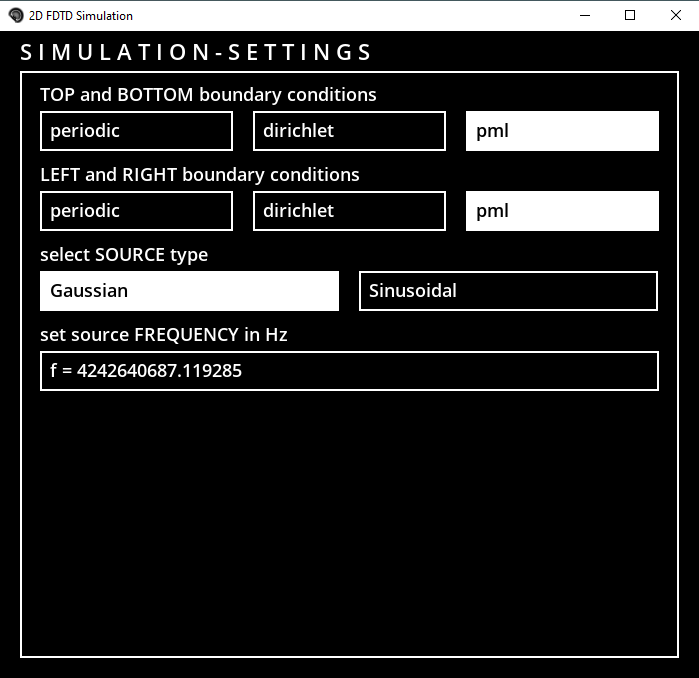
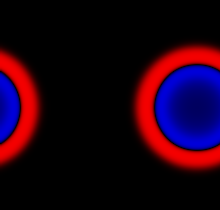

# Interactive 2D FDTD Simulator

Interactive 2D electromagnetic simulation environment for educational purposes. There are multiple options for boundary conditions and sources.

## Demo

<video src="2D_FDTD_DEMO.mp4" controls="controls" style="max-width: 730px;">
</video>

## Menu

An interactive main menu and sub menues makes navigation easy

  
   

## Boundary Conditions

Currently supported are dirichlet and periodic boundary conditions and unidirectional perfectly matched layer (PML). The BC can be indicvidually selected 
for the left-right and top-bottom boundaries.

  
   
  

## Simulation

The simulator uses the 2D finite difference time domain (FDTD) method 
and simulates the TE-mode (could be easily extended to compute the TM-mode also).

  
   

## Sources

The sources can be placed in realtime by pressing the left mouse button at the desired location. Currently only gaussian pulse and sinnusoidal sources are 
implemented as soft sources. Source frequency can be set in the respective menu. Spacebar pauses the simulation and spacebar resets it (removes the sources).

## Material Editor

A small editor is included, where shapes such as rectangles, circles and polygons (triangles) can be arbitrarily spaced within the problem space. Permittivity 
and Permeabiliyty can be set before placement. Backspace in the editor menu removes the latest material placed. Also Materials can be imported from image files 
as bitmap, but the path to the file and the material properties have to be specified in the configuration file.

  
   

## GPU

GPU acceleration is supported via numbas cuda jit compiler. Also runs fine on CPU when the simulation grid still fits in the cache.
